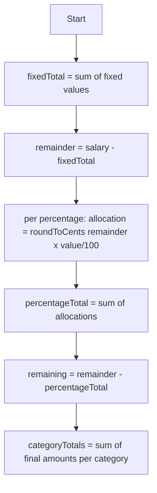
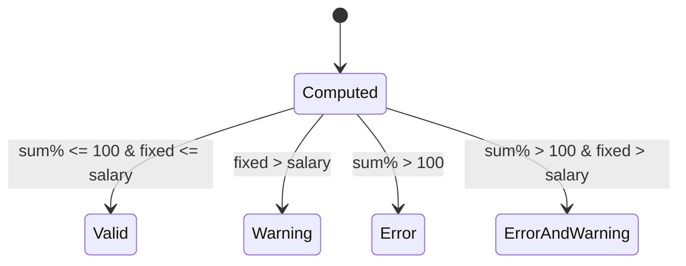
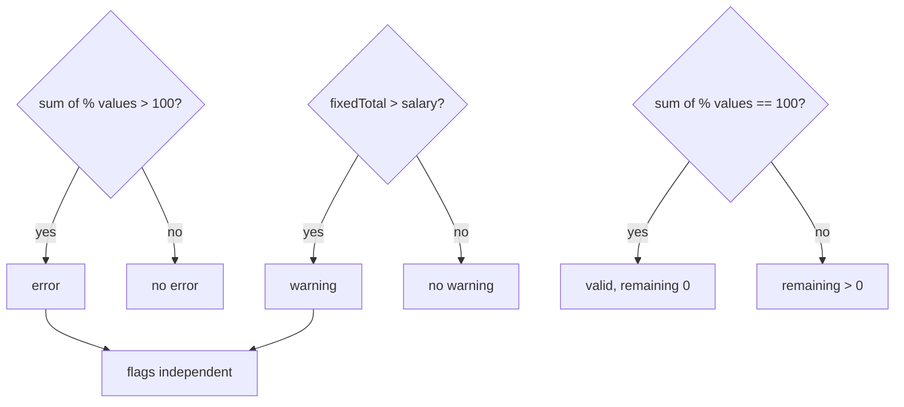

# Budget Allocation — Business Rules

Requirements-level diagrams for the budget allocation engine (ENG-5).

## Allocation pipeline

```mermaid
flowchart TD
    A[Start] --> B[fixedTotal = sum of fixed values]
    B --> C[remainder = salary - fixedTotal]
    C --> D[per percentage: allocation = roundToCents remainder x value/100]
    D --> E[percentageTotal = sum of allocations]
    E --> F[remaining = remainder - percentageTotal]
    F --> G[categoryTotals = sum of final amounts per category]
```

## Result states

```mermaid
stateDiagram-v2
    [*] --> Computed
    Computed --> Valid: sum% <= 100 & fixed <= salary
    Computed --> Warning: fixed > salary
    Computed --> Error: sum% > 100
    Computed --> ErrorAndWarning: sum% > 100 & fixed > salary
```

## Validation decisions

```mermaid
flowchart TD
    P1{sum of % values > 100?}
    P1 -->|yes| E[error]
    P1 -->|no| NE[no error]
    P2{fixedTotal > salary?}
    P2 -->|yes| W[warning]
    P2 -->|no| NW[no warning]
    S{sum of % values == 100?}
    S -->|yes| V[valid, remaining 0]
    S -->|no| R[remaining > 0]
    E --> IND[flags independent]
    W --> IND
```
